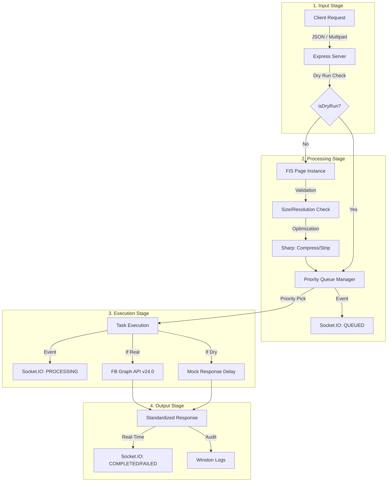

# Unified Social Media Manager (USSM)

USSM is a high-performance, multi-tenant gateway designed to centralize and optimize social media interactions. It provides a standardized interface for posting content, managing media, and monitoring activity across multiple platforms like Facebook and (soon) X/Twitter.

**Production Endpoint:** `https://ussm.global-desk.top`
**Live Monitor:** `https://ussm.global-desk.top`

---

## 📖 How to Use USSM

USSM operates as a secure proxy. You can target specific accounts/pages by providing their credentials in the request headers.

### 1. Request Headers
To target a specific social media account, include these headers in your request.

| Header | Description |
| :--- | :--- |
| `x-platform-id` | The unique ID of the target Page/Account (e.g. Facebook Page ID). |
| `x-platform-token` | The authentication secret. Format varies by platform (see below). |

#### Authentication Schemas
USSM uses an **Adaptive Token Strategy** to support diverse platform requirements while remaining a stateless proxy. The content of the `x-platform-token` header is interpreted based on the `platform` parameter:

1.  **Raw String (Simple Token)**
    *   Best for: Facebook, simple API keys.
    *   **Value:** `EAAg...`
    
2.  **JSON String (Multi-part Auth)**
    *   Best for: Platforms requiring multiple keys (like X/Twitter).
    *   **Value:** `{"apiKey": "...", "apiSecret": "...", ...}`

3.  **Base64 Encoded (Recommended)**
    *   Best for: Avoiding special character issues in HTTP headers when sending JSON.
    *   **Logic:** The service detects if the string is Base64 and automatically decodes it before parsing.

---

### 2. API Endpoints

#### `POST /v1/post`
Create a new post on the specified platform(s). Supports JSON or `multipart/form-data`.

**JSON Parameters:**
*   `platform` (string, **required**): The target platform. Supported: `fb` (Facebook). Coming soon: `x` (Twitter).
*   `caption` (string, required): The text content of the post.
*   `media` (array, optional): List of media objects.
    *   `source` (string/buffer): URL or binary data of the image/video.
    *   `type` (string): Either `image` or `video`.
*   `priority` (number, optional): `10` (Critical), `5` (High), `0` (Normal). Defaults to `0`.
*   `options` (object, optional):
    *   `publishToFeed` (boolean): Default `true`.
    *   `publishToStory` (boolean): Default `false`.
    *   `dryRun` (boolean): Default `false`.
    *   `retryConfig` (object): (Optional) `{ maxRetries: number, backoffMs: number }`.

**Example Request:**
```json
{
  "platform": "fb",
  "caption": "Check out our latest announcement!",
  "priority": 5,
  "options": {
    "publishToFeed": true,
    "publishToStory": true
  }
}
```

#### `POST /v1/post/:id/update`
Edit an existing post's caption.

**Parameters:**
*   `id` (path): The platform-specific Post ID.
*   `platform` (string, **required**): The target platform (e.g., `fb`).
*   `caption` (string, required): The new text content.
*   `priority` (number, optional): Processing priority.
*   `dryRun` (boolean, optional): If true, simulates the update.

**Example Request:**
```json
{
  "platform": "fb",
  "caption": "Update: The event has been rescheduled to 6 PM.",
  "priority": 10
}
```

#### `GET /v1/stats`
Retrieve global processing statistics, including queue lengths and success rates.

#### `GET /health`
Basic service health check and uptime information.

---

### 3. Media Processing
When using `multipart/form-data`, attach your image/video files to the `media` field.
*   **File Limit**: 1MB per file.
*   **Max Resolution**: 3000x3000px.
*   **Auto-Optimization**: USSM automatically strips metadata and applies high-quality compression to ensure optimal delivery and privacy.

---

## 🏗 Data Processing Flow



---

## 🧪 Testing with Dry Run
You can simulate any request without hitting the Facebook API by adding `"dryRun": true` to your payload. 
*   The API returns a mock `postId` (e.g., `DRY_RUN_abc123`).
*   The **Live Monitor** will label the data packet as **"DRY"** for visual verification.

---

## ⚡ Technical Specs
*   **Priority System**: 
    *   `10` (Critical): Immediate processing.
    *   `5` (High): Elevated queue position.
    *   `0` (Normal): Standard background processing.
*   **API Version**: Facebook Graph API v24.0.
*   **Fail-Safe**: Automatic transition to text-only if media upload fails or is rejected.

---

## 🛠 Quick Setup (Self-Hosting)
1. `pnpm install`
2. `pnpm dev` (Port 3005)
3. `pnpm build`
