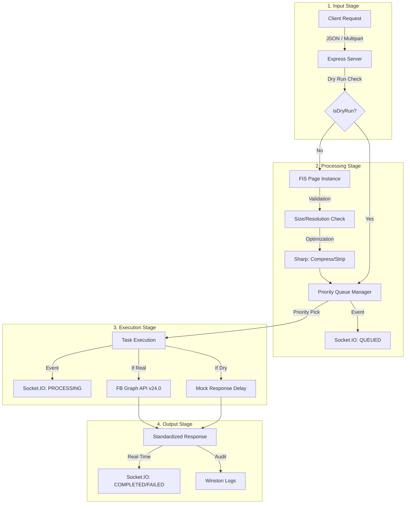

# USMM | Spider Pipeline

USMM is a high-performance, multi-tenant gateway designed to centralize and optimize social media interactions. It provides a standardized interface for posting content, managing media, and monitoring activity through an elegant, real-time "Red Spider Lily" visualization.

**Production Endpoint:** `https://usmm.global-desk.top`
**Live Monitor:** `https://usmm.global-desk.top`

---

## 📖 How to Use USMM

USMM operates as a secure proxy. You can target specific accounts/pages by providing their credentials in the request headers.

### 1. Request Headers
To target a specific social media account, include these headers in your request.

| Header | Description |
| :--- | :--- |
| `x-platform-id` | The unique ID of the target Page/Account (e.g. Facebook Page ID). |
| `x-platform-token` | The authentication secret. Format varies by platform (see below). |

#### Authentication Schemas
USMM uses an **Adaptive Token Strategy** to support diverse platform requirements while remaining a stateless proxy. The content of the `x-platform-token` header is interpreted based on the `platform` parameter:

1.  **Raw String (Simple Token)**
    *   Best for: Facebook (`fb`), simple API keys.
    *   **Value:** `EAAg...`
    
2.  **JSON String (Multi-part Auth)**
    *   Best for: X/Twitter (`x`) using OAuth 1.0a.
    *   **Structure:**
        ```json
        {
          "appKey": "...",
          "appSecret": "...",
          "accessToken": "...",
          "accessSecret": "..."
        }
        ```

3.  **Base64 Encoded (Recommended)**
    *   Best for: Avoiding special character issues in HTTP headers when sending JSON.
    *   **Logic:** The service detects if the string is Base64 and automatically decodes it before parsing.

---

### 2. API Endpoints

#### `POST /v1/post`
Create a new post on the specified platform(s). Supports JSON or `multipart/form-data`.

**JSON Parameters:**
*   `platform` (string, **required**): The target platform. Supported: `fb` (Facebook), `x` (Twitter).
*   `caption` (string): The text content of the post. **Mandatory** for feed posts, but optional if `publishToFeed` is set to `false` (e.g., for Story-only posts). *Note: If both caption and media altText are missing, USMM automatically generates a fallback ID (pageId_timestamp) to satisfy platform metadata requirements.*
*   `media` (array, optional): List of media objects.
    *   `source` (string/buffer): URL or binary data of the image/video.
    *   `type` (string): Either `image` or `video`.
    *   `altText` (string, optional): Accessibility text or story caption. Fallbacks to global `caption` if provided.
*   `priority` (number, optional): `10` (Critical), `5` (High), `0` (Normal). Defaults to `0`.
*   `options` (object, optional):
    *   `publishToFeed` (boolean): Default `true`.
    *   `publishToStory` (boolean): Default `false` (FB only).
    *   `dryRun` (boolean): Default `false`. Performs a simulated post.
    *   `validateToken` (boolean): Default `false`. 
        *   **Facebook**: Always performs real-time validation against the API (safe quota).
        *   **X (Twitter)**: By default, only structural validation is performed to save the very limited Free/Basic tier read quota. Set to `true` to force a real API verification (`v1.1/verify_credentials`).
    *   `retryConfig` (object): (Optional) `{ maxRetries: number, backoffMs: number }`.

**Example Request (Facebook):**
```json
{
  "platform": "fb",
  "caption": "Check out our latest announcement!",
  "priority": 5,
  "options": {
    "publishToFeed": true,
    "publishToStory": true
  }
}
```

**Example Request (X/Twitter):**
```json
{
  "platform": "x",
  "caption": "Breaking news from USMM! #automation",
  "priority": 10
}
```

#### `POST /v1/post/:id/update`
Edit an existing post's caption. *Note: Only supported on Facebook currently.*

**Parameters:**
*   `id` (path): The platform-specific Post ID.
*   `platform` (string, **required**): The target platform (e.g., `fb`).
*   `caption` (string, required): The new text content.
*   `priority` (number, optional): Processing priority.
*   `dryRun` (boolean, optional): If true, simulates the update.

**Example Request:**
```json
{
  "platform": "fb",
  "caption": "Update: The event has been rescheduled to 6 PM.",
  "priority": 10
}
```

#### `GET /v1/stats`
Retrieve global processing statistics, including queue lengths and success rates.

#### `GET /health`
Basic service health check and uptime information.

---

### 3. Media Processing
When using `multipart/form-data`, attach your image/video files to the `media` field.
*   **Image Limit**: 10MB per file.
*   **Video Limit**: 100MB per file.
*   **Max Resolution**: 3000x3000px (Images).
*   **Auto-Optimization**: USMM automatically strips metadata and applies high-quality compression to images to ensure optimal delivery and privacy.
*   **Protocol Compliance (v24.0)**: 
    *   **Photos**: Uploaded to `graph.facebook.com` and attached to feed via `media_fbid`.
    *   **Videos**: Uploaded via dedicated `graph-video.facebook.com` infrastructure. Feed publication is handled directly on the video node to ensure full compatibility with Page permissions.
    *   **Alt-Text**: Automatically generated if missing (`pageId_epoch_index`) to satisfy v24.0 mandatory story metadata requirements.

---

## 🏗 Data Processing Flow



---

## 🧪 Testing with Dry Run
You can simulate any request without hitting the underlying platform API by adding `"dryRun": true` to your payload. 
*   The API returns a mock `postId` (e.g., `DRY_RUN_abc123`).
*   The **Live Monitor** (`https://usmm.global-desk.top`) will label the data packet as **"DRY"** for visual verification.

---

## 📡 Real-Time Monitoring
Visit the root URL (`https://usmm.global-desk.top`) to view the **Spider Pipeline**.
*   **Red Spider Lily Visualization**: Data enters via the **Stem** (bottom-center) and travels to the **USMM Core** (The Flower Heart).
*   **Spirit Orbs**: Incoming data is transformed into "Spirit Orbs" that traverse the flower's structure.
*   **Spider Filaments (Pistils)**: Individual Social Media projects are represented by delicate, swaying pistils. When data reaches the end of a pistil, it "shatters" into an ethereal particle effect and floats upward, revealing the brand's logo within the orb.
*   **Physics-Engine**: Supports **100 concurrent project filaments** with procedural swaying and organic "scoop" Bezier paths.
*   **Live Tracking**: The UI maintains a 1:1 mapping between data packets and their target filaments, even as they sway and regenerate.

---

## ⚡ Technical Specs
*   **Security (Zero-Registration)**: 
    *   **Tenant-Aware Rate Limiting**: Requests are limited by a combined key of `Sender IP + x-platform-id`. This prevents distributed spam against specific accounts.
    *   **Stateless Architecture**: No user database required; credentials are interpreted in-flight and never stored.
*   **Multi-Tenant Isolation**: Every unique project receives a dedicated service instance and private priority queue.
*   **Resource Management**: 
    *   **Global Concurrency Cap**: Processing is strictly limited to **100 concurrent tasks** across all instances to ensure system stability and low CPU overhead.
    *   **UI Optimization**: The Spider Pipeline UI is rendered on a high-performance canvas, efficiently handling 100+ simultaneous animations.
*   **Priority System**: 
    *   `10` (Critical): Immediate processing.
    *   `5` (High): Elevated queue position.
    *   `0` (Normal): Standard background processing.
*   **API Versions**: 
    *   Facebook: Graph API v24.0
    *   X / Twitter: API v2 (Tweets) & v1.1 (Media)
*   **Fail-Safe**: Automatic transition to text-only if media upload fails or is rejected.

---

## 🧪 Stress Testing
The system includes simulation scripts to verify high-concurrency handling and UI performance.
*   **Unit Tests**: `pnpm test` (Basic API validation).
*   **Load Test**: `pnpm vitest run tests/load.test.ts` (Simulates 15 concurrent requests).
*   **Live Simulation**: `node tests/live_simulation.js` (Dispatches requests for **100 concurrent projects** over a 30s window to stress-test the Spider Pipeline UI).

---

## 🛠 Quick Setup (Self-Hosting)
1. `pnpm install`
2. `pnpm dev` (Port 3005)
3. `pnpm build`
