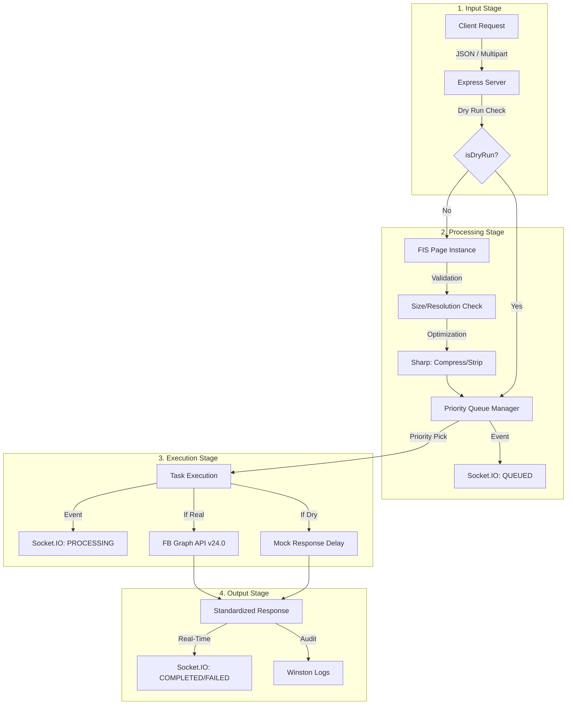

# USMM | Spider Pipeline

USMM is a high-performance, multi-tenant gateway designed to centralize and optimize social media interactions. It provides a standardized interface for posting content, managing media, and monitoring activity through an elegant, real-time "Red Spider Lily" visualization.

**Production Endpoint:** `https://usmm.global-desk.top`
**Live Monitor:** `https://usmm.global-desk.top`

---

## 📖 How to Use USMM

USMM operates as a secure proxy. You can target specific accounts/pages by providing their credentials in the request headers.

### 1. Request Headers
To target a specific social media account, include these headers in your request. USMM supports both **platform-specific** (recommended) and **generic** headers.

#### Recommended (Specialized)
| Platform | ID Header | Token Header |
| :--- | :--- | :--- |
| **Facebook** | `x-fb-id` (Page ID) | `x-fb-token` (Access Token) |
| **X (Twitter)** | `x-x-id` (Optional) | `x-x-token` (JSON/Base64 Keys) |
| **Slack** | `x-slack-id` (Optional) | `x-slack-token` (Webhook URL) |

#### Generic (Legacy/Router)
| Header | Description |
| :--- | :--- |
| `x-platform-id` | The unique ID of the target Page/Account. |
| `x-platform-token` | The authentication secret. |

#### Authentication Schemas
USMM uses an **Adaptive Token Strategy** to support diverse platform requirements while remaining a stateless proxy. The content of the `x-platform-token` header is interpreted based on the `platform` parameter:

1.  **Raw String (Simple Token)**
    *   Best for: Facebook (`fb`), Slack Webhooks (`slack`), simple API keys.
    *   **Value:** `EAAg...` (FB) or `https://hooks.slack.com/services/...` (Slack).
    
2.  **JSON String (Multi-part Auth)**
    *   Best for: X/Twitter (`x`) using OAuth 1.0a.
    *   **Structure:**
        ```json
        {
          "appKey": "...",
          "appSecret": "...",
          "accessToken": "...",
          "accessSecret": "..."
        }
        ```

3.  **Base64 Encoded (Recommended)**
    *   Best for: Avoiding special character issues in HTTP headers when sending JSON.
    *   **Logic:** The service detects if the string is Base64 and automatically decodes it before parsing.

---

### 2. API Endpoints

USMM provides both a generic "Smart Router" endpoint and platform-specific specialized endpoints.

#### Generic Endpoint: `POST /v1/post`
Routes requests based on the `platform` field in the JSON body.

#### Specialized Endpoints (Recommended)
These endpoints automatically assume the platform based on the URL, allowing for cleaner payloads (the `platform` field can be omitted in the body).

*   **Facebook**: `POST /v1/fb/post` | `POST /v1/fb/post/:id/update`
*   **X (Twitter)**: `POST /v1/x/post` | `POST /v1/x/post/:id/update`
*   **Slack**: `POST /v1/slack/post`

**JSON Parameters:**
*   `platform` (string, **required for generic endpoint**): The target platform. Supported: `fb`, `x`, `slack`.
*   `caption` (string): The text content or Slack Block-Kit-HTML (see section 3).
*   `media` (array, optional): List of media objects.
    *   `source` (string/buffer): URL or binary data of the image/video.
    *   `type` (string): Either `image` or `video`.
    *   `altText` (string, optional): Accessibility text or story caption. Fallbacks to global `caption` if provided.
*   `priority` (number, optional): `10` (Critical), `5` (High), `0` (Normal). Defaults to `0`.
*   `options` (object, optional):
    *   `publishToFeed` (boolean): Default `true`.
    *   `publishToStory` (boolean): Default `false` (FB only).
    *   `dryRun` (boolean): Default `false`. Performs a simulated post.
    *   `validateToken` (boolean): Default `false`. 
    *   `slackUsername` (string, optional): Override the bot name on Slack (defaults to `USMM`).
    *   `slackIconUrl` (string, optional): Override the bot icon via URL.
    *   `slackIconEmoji` (string, optional): Override the bot icon via emoji (e.g. `:spider:`). Takes priority over `slackIconUrl`.
    *   `retryConfig` (object): (Optional) `{ maxRetries: number, backoffMs: number }`.

**Example Request (Slack):**
```json
{
  "caption": "<div class='header'>🚀 Deployment Success</div><div class='section'>Production was updated to <b>v2.4.0</b>.</div><hr /><a href='https://example.com' class='btn-primary'>View Logs</a>",
  "priority": 5
}
```

#### `GET /v1/stats`
Retrieve global processing statistics, including queue lengths and success rates.

#### `GET /health`
Basic service health check and uptime information.

### 3. Slack "Utility-First" Formatting (USMM)
USMM includes a built-in framework that converts a simplified HTML/Tailwind-like syntax into Slack **Block Kit** automatically.

#### Structural Blocks
| USMM Tag | Class / Attribute | Slack Block |
| :--- | :--- | :--- |
| `<div class="header">` | N/A | `header` (Bold title) |
| `<div class="section">` | N/A | `section` (Standard text) |
| `<div class="field">` | (Inside section) | `section.fields` (2-column grid) |
| `<div class="context">` | N/A | `context` (Mixed text/images) |
| `<ul>` / `<li>` | N/A | `rich_text` (Bulleted list) |
| `<hr />` | N/A | `divider` |

#### Interactive & Media
| USMM Tag | Class / Attribute | Slack Block |
| :--- | :--- | :--- |
| `<a>` | `class="btn-primary"` | `button` (Blue) |
| `<a>` | `class="btn-danger"` | `button` (Red) |
| `<select>` | `placeholder="..."` | `static_select` |
| `<select multiple>` | N/A | `multi_static_select` |
| `<select class="overflow">`| N/A | `overflow` menu |
| `<input type="date">` | `value="YYYY-MM-DD"` | `datepicker` |
| `<input type="time">` | `value="HH:mm"` | `timepicker` |
| `` | `src="..." title="..."` | `image` (Block or Accessory) |

#### Interactive Logic
*   **Confirmation Dialogs**: Wrap button text in `<confirm title="..." confirm="..." deny="...">Message</confirm>` to trigger a Slack confirmation popup.
*   **Overflow Styles**: Use `<option class="danger">` inside an overflow menu for red-styled critical actions.

#### Data Integrity
*   **Smart Splitting**: Sections exceeding Slack's 3000-character limit are automatically split into multiple sequential blocks, preserving all data (ideal for long Gemini AI reports).
*   **Boundary Protection**: USMM automatically enforces platform-specific hard-caps (e.g., 2000 chars for fields, 75 for buttons) to prevent payload rejection.

#### Inline Markdown (Auto-converted)
*   `<b>` / `<strong>` → `*bold*`
*   `<i>` / `<em>` → `_italic_`
*   `<code>` → `` `code` ``
*   `<br />` → `\n` (newline)
*   `<a href="...">` → `<url|link>`

---

### 4. Media Processing
When using `multipart/form-data`, attach your image/video files to the `media` field.
*   **Image Limit**: 10MB per file.
*   **Video Limit**: 100MB per file.
*   **Auto-Optimization**: USMM automatically strips metadata, applies high-quality compression, and **automatically downscales images to 2048px** if they exceed platform limits, ensuring zero "Hard Fails" for high-res screenshots.
*   **Protocol Compliance (v24.0)**: 
    *   **Photos**: Uploaded to `graph.facebook.com` and attached to feed via `media_fbid`.
    *   **Videos**: Uploaded via dedicated `graph-video.facebook.com` infrastructure. Feed publication is handled directly on the video node to ensure full compatibility with Page permissions.
    *   **Alt-Text**: Automatically generated if missing (`pageId_epoch_index`) to satisfy v24.0 mandatory story metadata requirements.

---

## 🏗 Data Processing Flow



---

## 🧪 Testing with Dry Run
You can simulate any request without hitting the underlying platform API by adding `"dryRun": true` to your payload. 
*   The API returns a mock `postId` (e.g., `DRY_RUN_abc123`).
*   The **Live Monitor** (`https://usmm.global-desk.top`) will label the data packet as **"DRY"** for visual verification.

---

## 📡 Real-Time Monitoring
Visit the root URL (`https://usmm.global-desk.top`) to view the **Spider Pipeline**.
*   **Red Spider Lily Visualization**: Data enters via the **Stem** (bottom-center) and travels to the **USMM Core** (The Flower Heart).
*   **Spirit Orbs**: Incoming data is transformed into "Spirit Orbs" that traverse the flower's structure.
*   **Spider Filaments (Pistils)**: Individual Social Media projects are represented by delicate, swaying pistils. When data reaches the end of a pistil, it "shatters" into an ethereal particle effect and floats upward, revealing the brand's logo within the orb.
*   **Physics-Engine**: Supports **100 concurrent project filaments** with procedural swaying and organic "scoop" Bezier paths.
*   **Live Tracking**: The UI maintains a 1:1 mapping between data packets and their target filaments, even as they sway and regenerate.

---

## ⚡ Technical Specs
*   **Security & Privacy**: 
    *   **Stateless Proxy**: Credentials are interpreted in-flight and never stored permanently.
    *   **Rolling Cache (Redis)**: Account IDs and active filaments are cached in Redis with a **24-hour sliding expiration**. If an account is inactive for a day, all its references are automatically purged.
    *   **Task Recovery (v2.0)**: Pending tasks are persisted in Redis. Upon server restart, USMM automatically reloads and resumes any unfinished tasks to ensure 100% delivery reliability.
    *   **Task Privacy**: Completed tasks are **immediately deleted** from the database. Failed tasks are retained for 1 hour for debugging before auto-deletion.
    *   **Early Validation**: Authentication is verified *before* heavy processing (like image resizing) to save server resources.
    *   **Tenant-Aware Rate Limiting**: Requests are limited by a combined key of `Sender IP + x-platform-id`. This prevents distributed spam against specific accounts.
*   **Multi-Tenant Isolation**: Every unique project receives a dedicated service instance and private priority queue.
*   **Resource Management**: 
    *   **Priority System**: 
        *   `10` (Critical): Immediate processing.
        *   `5` (High): Elevated queue position.
        *   `0` (Normal): Standard background processing.
        *   **Dry Runs**: Automatically penalized (-100 priority) to ensure actual requests are always processed first.
    *   **Global Concurrency Cap**: Processing is strictly limited to **100 concurrent tasks** across all instances.
    *   **UI Optimization**: The Spider Pipeline UI is rendered on a high-performance canvas, efficiently handling 100+ simultaneous animations.
*   **API Versions**: 
    *   Facebook: Graph API v24.0
    *   X / Twitter: API v2 (Tweets) & v1.1 (Media)
    *   Slack: Webhook Integration
*   **Protocol Compliance**: All external requests explicitly bypass proxies (`proxy: false`) for maximum reliability.
    *   **Strict Validation**: USMM performs real-time metadata validation for images (resolution/integrity) and structural validation for multi-part auth tokens.
    *   **High-Reliability Video (Chunked Uploads)**: Large video assets (up to 100MB) are processed using chunked/resumable upload protocols for both Facebook and X (Twitter), ensuring parity and stability for high-res content like seismic replays.
    *   **Fail-Safe**: Automatic transition to text-only if media upload fails or is rejected by the target platform.
---

## 🧪 Stress Testing
The system includes simulation scripts to verify high-concurrency handling and UI performance.
*   **Unit Tests**: `pnpm test` (Basic API validation).
*   **Load Test**: `pnpm vitest run tests/load.test.ts` (Simulates 15 concurrent requests).
*   **Live Simulation**: `node tests/live_simulation.js` (Dispatches requests for **100 concurrent projects** over a 30s window to stress-test the Spider Pipeline UI).

---

## 🛠 Quick Setup (Self-Hosting)
1. `pnpm install`
2. `pnpm dev` (Port 3005)
3. `pnpm build`
